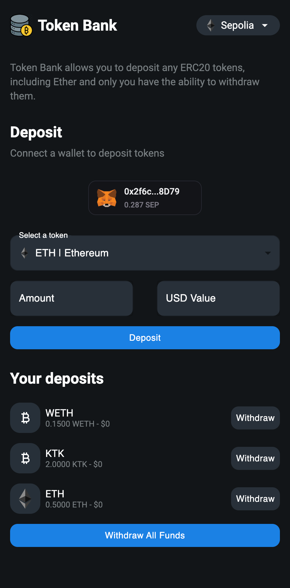
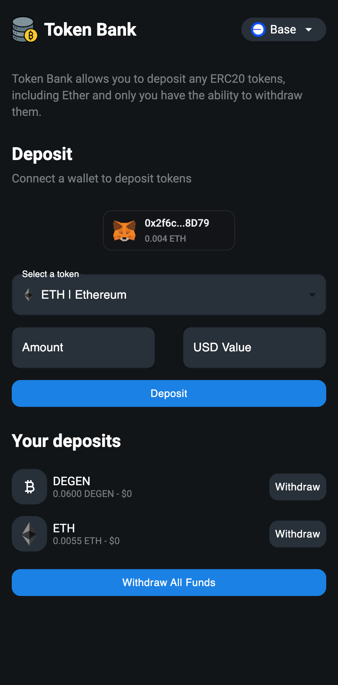

# TokenBank

TokenBank is a decentralized application (dApp) that allows users to manage their ERC-20 tokens securely and efficiently. Deployed on Sepolia (Testnet) and Base (Mainnet), it offers functionalities such as depositing, withdrawing, and viewing ERC-20 token balances directly through a user-friendly interface.

[TokenBank Video Demo](https://github.com/RamanSB/Token-Bank/assets/13969478/076b84d3-22b1-4311-afbc-f01fe230e2c1)






## Development & Issues

**I encourage you all to view the issues and raise PRs where a fix can be put in place, not only will this make TokenBank more resilient but is a net positive for the open source community.**
- Thirdweb (useContractEvents throws error)
- Chainlink USD Value 

## Features

- **Wallet Connection**: Users can easily connect their wallets to interact with the application.
- **Token Management**: Deposit and withdraw ERC-20 tokens.
- **Real-time Balance Updates**: Fetch and display the updated balance of a users ERC-20 token in their deposits.
- **Deposit / Withdraw**: Basic functionality regarding interacting with ERC20 tokens and transferring / sending native network tokens for deposit purposes. As well as withdrawl functionality..
- **User-friendly UI**: A sleek interface built with React and Next.js, ensuring a seamless user experience.

## Technology Stack

- **Frontend**: React, Next.js
- **Blockchain**: Solidity, Thirdweb
- **Smart Contracts**: IERC20, Checks-Effects-Interactions Pattern, ReEntrancyGuard
- **Testnet**: Sepolia
- **Mainnet**: Base
- **Tools**: Foundry, Alchemy, ThirdWeb (React / TypeScript) SDK.

## Setup and Installation

Setup and installation for both the frontend / smart-contracts can be found in the README.md files in their respective directories.

### Cloning the Repository

```bash
git clone https://github.com/RamanSB/tokenbank.git
cd tokenbank
```
